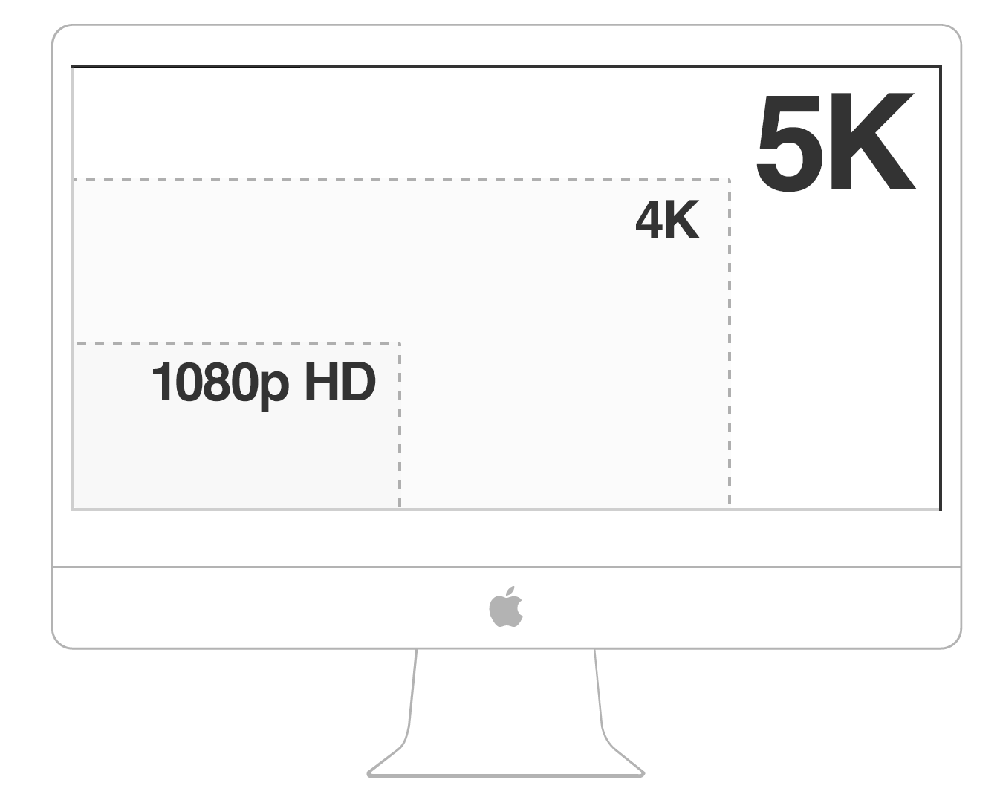
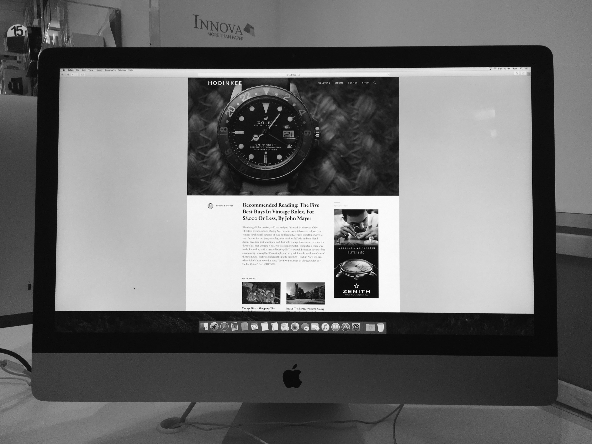

#Responsive Images Tutorial

##Introduction

Device manufacturers like Apple are offering displays with higher and higher resolutions.

In October of 2015, Apple announced all 27-inch iMacs will be sold with a 5K display.

*5K resolution refers to a pixel dimension of 5,120×2,880, equivalent to about 14.7 million pixels.*

Our sites have typically been designed with a max width of 1,440 pixels.

*The maximim width of the site pictured above is 1,440 pixels. On a 4K display more than one thousand pixels occupy the space to the right and left hand side of its design. On a 5K display, almost two thousand pixels buffers each side.*

Since 2010, savvy developers have been building sites with fluid widths, whereby its grid, images, and text dynamically scale according to the width of the observing browser.

Notice how the layout of [The Great Discontent](http://thegreatdiscontent.com) occupies the entire width of the observing browser.