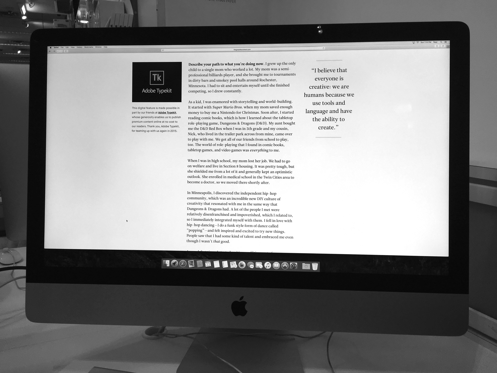
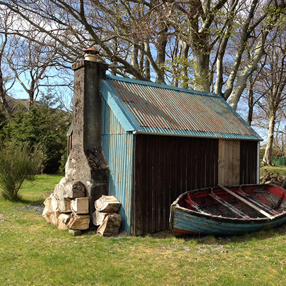

#Responsive Images Tutorial

##Introduction

Over time, device manufacturers like Apple offer displays with higher and higher resolutions.

In October of 2015, Apple announced all 27-inch iMacs will be sold with a [5K display](www.theverge.com/2015/10/13/9512503/apple-imac-update-27-inch-5k-price-release-date-specs).


<sub>5K resolution refers to a pixel dimension of 5,120×2,880, equivalent to about 14.7 million pixels.</sub>


<sub>The maximim width of the sites like the one pictured above is 1,440 pixels. On a 4K display more than one thousand pixels occupy the space to the its right and left hand side. On a 5K display, almost two thousand pixels buffers each side.</sub>

Since [2010](http://alistapart.com/article/responsive-web-design), savvy developers like [The Great Discontent](http://thegreatdiscontent.com) have been building sites with fluid widths—whereby its grid, images, and text dynamically scale according to the width of the observing browser.


<sub>Notice how the layout of The Great Discontent on a 4K display occupies the entire width of the observing browser.</sub>



<sub>The Great Discontent defines its container by the observing browser-width rather than a fixed-dimension.</sub>

##Fluid Width Images

Let’s practice responsive web design by creating a fluid-width layout of cabin pornography.

**Step 1**

Download the [ZIP file](https://github.com/michaelryap/responsive-images-tutorial/archive/master.zip) containing the images we’ll be using.

**Step 2**

Fire up Sublime Text and create a new HTML file.

````
<!doctype html>

<html>

<head>
	<meta charset="utf-8" >
	<style></style>
</head>

<body></body>

</html>
````

**Step 2**

Add the images.

````





````

**Step 3**

Add a paragraph to display messages. (This will make sense in about 6 more lines of code.)

`<p>My width is </p>`

